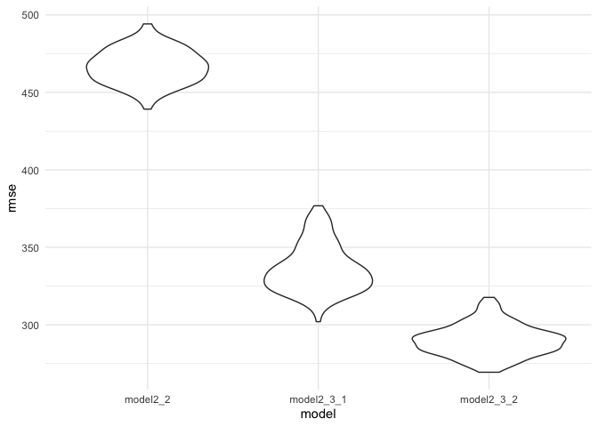

p8105\_hw6\_yf2563
================
Yatong Feng
12/7/2020

``` r
library(tidyverse)
library(modelr)

knitr::opts_chunk$set(
  message = F,
  warning = F
)
theme_set(theme_minimal() + theme(legend.position = "bottom"))
options(
  ggplot2.continuous.colour = "viridis",
  ggplot2.continuous.fill = "viridis"
)
scale_colour_discrete = scale_color_viridis_d
scale_fill_discrete = scale_fill_viridis_d
```

## Problem 1

The Washington Post has gathered data on homicides in 50 large U.S.
cities.

  - Create a city\_state variable (e.g. “Baltimore, MD”)
  - binary variable indicating whether the homicide is solved.
  - Omit cities Dallas, TX; Phoenix, AZ; and Kansas City, MO – these
    don’t report victim race.
  - omit Tulsa, AL – this is a data entry mistake.
  - For this problem, limit your analysis those for whom victim\_race is
    white or black.
  - Be sure that victim\_age is numeric.

<!-- end list -->

``` r
homicide_df = 
  read_csv("data/homicide-data.csv", na = c("", "NA", "Unknown")) %>% 
  mutate(
    city_state = str_c(city, state, sep = ", "),
    victim_age = as.numeric(victim_age),
    resolution = case_when(
      disposition == "Closed without arrest" ~ 0,
      disposition == "Open/No arrest"        ~ 0,
      disposition == "Closed by arrest"      ~ 1)
  ) %>% 
  filter(
    victim_race %in% c("White", "Black"),
    city_state != "Tulsa, AL") %>% 
  select(city_state, resolution, victim_age, victim_race, victim_sex)

head(homicide_df)
```

    ## # A tibble: 6 x 5
    ##   city_state      resolution victim_age victim_race victim_sex
    ##   <chr>                <dbl>      <dbl> <chr>       <chr>     
    ## 1 Albuquerque, NM          0         15 White       Female    
    ## 2 Albuquerque, NM          0         72 White       Female    
    ## 3 Albuquerque, NM          0         91 White       Female    
    ## 4 Albuquerque, NM          0         56 White       Male      
    ## 5 Albuquerque, NM          0         NA White       Male      
    ## 6 Albuquerque, NM          1         43 White       Female

For the city of Baltimore, MD:

  - use the glm function to fit a logistic regression with resolved vs
    unresolved as the outcome and victim age, sex and race as
    predictors.
  - Save the output of glm as an R object;
  - apply the broom::tidy to this object;
  - obtain the estimate and confidence interval of the adjusted odds
    ratio for solving homicides comparing non-white victims to white
    victims keeping all other variables fixed.

<!-- end list -->

``` r
baltimore_df =
  homicide_df %>% 
  filter(city_state == "Baltimore, MD")
glm(resolution ~ victim_age + victim_race + victim_sex, 
    data = baltimore_df,
    family = binomial()) %>% 
  broom::tidy() %>% 
  mutate(
    OR = exp(estimate),
    CI_lower = exp(estimate - 1.96 * std.error),
    CI_upper = exp(estimate + 1.96 * std.error)
  ) %>% 
  select(term, OR, starts_with("CI")) %>% 
  knitr::kable(digits = 3)
```

| term              |    OR | CI\_lower | CI\_upper |
| :---------------- | ----: | --------: | --------: |
| (Intercept)       | 1.363 |     0.975 |     1.907 |
| victim\_age       | 0.993 |     0.987 |     1.000 |
| victim\_raceWhite | 2.320 |     1.648 |     3.268 |
| victim\_sexMale   | 0.426 |     0.325 |     0.558 |

  - Now run glm for each of the cities in your dataset,
  - extract the adjusted odds ratio (and CI) for solving homicides
    comparing Black victims to white victims.
  - Do this within a “tidy” pipeline, making use of purrr::map, list
    columns, and unnest as necessary to create a dataframe with
    estimated ORs and CIs for each city.

<!-- end list -->

``` r
models_results_df = 
  homicide_df %>% 
  nest(data = -city_state) %>% 
  mutate(
    models = 
      map(.x = data, ~glm(resolution ~ victim_age + victim_race + victim_sex, data = .x, family = binomial())),
    results = map(models, broom::tidy)
  ) %>% 
  select(city_state, results) %>% 
  unnest(results) %>% 
  mutate(
    OR = exp(estimate),
    CI_lower = exp(estimate - 1.96 * std.error),
    CI_upper = exp(estimate + 1.96 * std.error)
  ) %>% 
  select(city_state, term, OR, starts_with("CI")) 

head(models_results_df)
```

    ## # A tibble: 6 x 5
    ##   city_state      term                OR CI_lower CI_upper
    ##   <chr>           <chr>            <dbl>    <dbl>    <dbl>
    ## 1 Albuquerque, NM (Intercept)      1.84     0.534    6.37 
    ## 2 Albuquerque, NM victim_age       0.981    0.963    0.998
    ## 3 Albuquerque, NM victim_raceWhite 1.51     0.668    3.41 
    ## 4 Albuquerque, NM victim_sexMale   1.77     0.831    3.76 
    ## 5 Atlanta, GA     (Intercept)      2.39     1.49     3.83 
    ## 6 Atlanta, GA     victim_age       0.988    0.979    0.997

Create a plot that shows the estimated ORs and CIs for each city.
Organize cities according to estimated OR, and comment on the plot.

``` r
models_results_df %>% 
  filter(term == "victim_sexMale") %>% 
  mutate(city_state = fct_reorder(city_state, OR)) %>% 
  ggplot(aes(x = city_state, y = OR)) + 
  geom_point() + 
  geom_errorbar(aes(ymin = CI_lower, ymax = CI_upper)) + 
  theme(axis.text.x = element_text(angle = 90, hjust = 1))
```

<!-- -->

## Problem 2

#### 2.1

Load and clean the data for regression analysis (i.e. convert numeric to
factor where appropriate, check for missing data, etc.).

``` r
baby_df = 
  read_csv("./data/birthweight.csv") %>% 
  mutate(babysex = as.factor(babysex),
         frace = as.factor(frace),
         malform = as.factor(malform),
         mrace = as.factor(mrace))

head(baby_df)
```

    ## # A tibble: 6 x 20
    ##   babysex bhead blength   bwt delwt fincome frace gaweeks malform menarche
    ##   <fct>   <dbl>   <dbl> <dbl> <dbl>   <dbl> <fct>   <dbl> <fct>      <dbl>
    ## 1 2          34      51  3629   177      35 1        39.9 0             13
    ## 2 1          34      48  3062   156      65 2        25.9 0             14
    ## 3 2          36      50  3345   148      85 1        39.9 0             12
    ## 4 1          34      52  3062   157      55 1        40   0             14
    ## 5 2          34      52  3374   156       5 1        41.6 0             13
    ## 6 1          33      52  3374   129      55 1        40.7 0             12
    ## # … with 10 more variables: mheight <dbl>, momage <dbl>, mrace <fct>,
    ## #   parity <dbl>, pnumlbw <dbl>, pnumsga <dbl>, ppbmi <dbl>, ppwt <dbl>,
    ## #   smoken <dbl>, wtgain <dbl>

#### 2.2

  - Propose a regression model for birthweight.
  - This model may be based on a hypothesized structure for the factors
    that underly birthweight, on a data-driven model-building process,
    or a combination of the two.
  - Describe your modeling process and show a plot of model residuals
    against fitted values – use add\_predictions and add\_residuals in
    making this plot.

<!-- end list -->

``` r
model2_2 = lm(bwt ~ gaweeks, data = baby_df)
```

``` r
baby_df %>% 
  modelr::add_residuals(model2_2) %>% 
  modelr::add_predictions(model2_2) %>% 
  ggplot(aes(x = pred, y = resid)) + 
  geom_point()+
  stat_smooth(method = "lm")
```

<!-- -->

#### 2.3 Compare your model to two others:

  - 2.3.1 length at birth and gestational age as predictors (main
    effects only)

<!-- end list -->

``` r
model2_3_1 = lm(bwt ~ blength + gaweeks, data = baby_df)
```

  - 2.3.2 head circumference, length, sex, and all interactions
    (including the three-way interaction) between these

<!-- end list -->

``` r
model2_3_2 = 
  lm(bwt ~ 
       bhead + blength + babysex + 
       bhead * blength + 
       bhead * babysex + 
       blength * babysex + 
       bhead * blength * babysex, 
     data = baby_df)
```

  - Make this comparison in terms of the cross-validated prediction
    error; use crossv\_mc and functions in purrr as appropriate.

<!-- end list -->

``` r
cv_df =
  crossv_mc(baby_df, 100) %>% 
  mutate(
    train = map(train, as_tibble),
    test = map(test, as_tibble))
```

``` r
cv_df = 
  cv_df %>% 
  mutate(
    model2_2  = map(train, ~lm(bwt ~ gaweeks, data = .x)),
    model2_3_1  = map(train, ~lm(bwt ~ blength + gaweeks, data = .x)),
    model2_3_2  = map(train, ~lm(bwt ~ 
       bhead + blength + babysex + 
       bhead * blength + 
       bhead * babysex + 
       blength * babysex + 
       bhead * blength * babysex, data = .x))) %>% 
  mutate(
    rmse_model2_2 = map2_dbl(model2_2, test, ~rmse(model = .x, data = .y)),
    rmse_model2_3_1 = map2_dbl(model2_3_1, test, ~rmse(model = .x, data = .y)),
    rmse_model2_3_2 = map2_dbl(model2_3_2, test, ~rmse(model = .x, data = .y)))
```

``` r
cv_df %>% 
  select(starts_with("rmse")) %>% 
  pivot_longer(
    everything(),
    names_to = "model", 
    values_to = "rmse",
    names_prefix = "rmse_") %>% 
  mutate(model = fct_inorder(model)) %>% 
  ggplot(aes(x = model, y = rmse)) + 
  geom_violin()
```

<!-- -->

## Problem 3

load data for prob3

``` r
weather_df = 
  rnoaa::meteo_pull_monitors(
    c("USW00094728"),
    var = c("PRCP", "TMIN", "TMAX"), 
    date_min = "2017-01-01",
    date_max = "2017-12-31") %>%
  mutate(
    name = recode(id, USW00094728 = "CentralPark_NY"),
    tmin = tmin / 10,
    tmax = tmax / 10) %>%
  select(name, id, everything())

head(weather_df)
```

    ## # A tibble: 6 x 6
    ##   name           id          date        prcp  tmax  tmin
    ##   <chr>          <chr>       <date>     <dbl> <dbl> <dbl>
    ## 1 CentralPark_NY USW00094728 2017-01-01     0   8.9   4.4
    ## 2 CentralPark_NY USW00094728 2017-01-02    53   5     2.8
    ## 3 CentralPark_NY USW00094728 2017-01-03   147   6.1   3.9
    ## 4 CentralPark_NY USW00094728 2017-01-04     0  11.1   1.1
    ## 5 CentralPark_NY USW00094728 2017-01-05     0   1.1  -2.7
    ## 6 CentralPark_NY USW00094728 2017-01-06    13   0.6  -3.8
